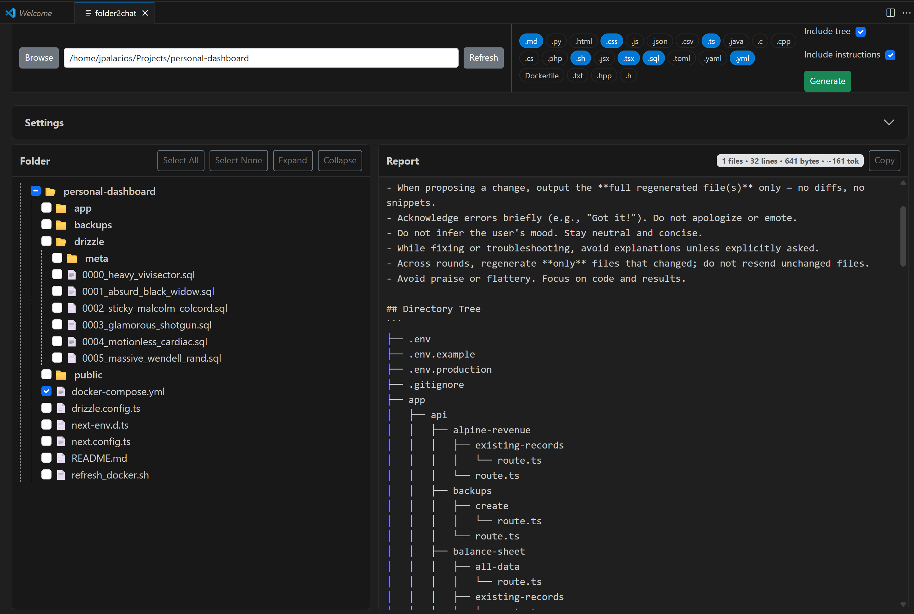

# folder2chat

A Visual Studio Code extension that helps you generate structured reports from project folders. Vibe-coding with friction if you will. I prefer to copy/paste from LLMs. Agents and auto-CLIs don't quite cut it for me yet. When I stop maintaining this tool (which I still use on a daily basis) you'll know I switched to agents.

jose (Sept. 2025)

## Features

- **Browse & Load a Folder**  
  Use the **Browse** or **Refresh** buttons to select a project folder and load its file tree.

- **File Tree Navigation**  
  - Displays a collapsible directory tree.
  - Click **folder icons/labels** to expand or collapse directories.
  - Click **file names or checkboxes** to select files.

- **Filtering**  
  - Extension chips are automatically populated from project files.  
  - Click chips to filter the visible files by extension.  
  - Selected chips persist until cleared.

- **Selection Shortcuts**  
  - **Select All** or **Select None** buttons.
  - Expand/Collapse all directories.
  - Keyboard shortcuts:  
    - `A` → Select All  
    - `N` → Select None  
    - `G` → Generate Report

- **Report Generation**  
  - Click **Generate** to create a Markdown report.  
  - Includes:
    - File contents (for selected files).
    - Optional **Directory Tree** section.
    - Optional **Instructions** section with agent rules.
  - If no files or options are selected, the report contains:  
    ```
    Empty report!
    ```
  - Stats bubble shows counts for **files, lines, bytes, and ~tokens** (consistent across report and UI).

- **Settings**  
  - Configure:
    - Max items per folder.
    - Default excluded folders (e.g., `.git`, `node_modules`).
    - Allowed text extensions.
  - Save settings to **workspace** or **global** scope.

- **Layout & UX**  
  - Flexible layout: tree and report panels expand to use available vertical and horizontal space.  
  - Toolbar stays sticky at the top with horizontal scroll for chips if crowded.  
  - Buttons have improved padding so they don’t rest directly against card edges.

## Screenshot

Here’s folder2chat in action inside VS Code:



## Usage

1. Open VS Code and run the command:  
````

folder2chat: Open

````
2. Load a folder with **Browse** or **Refresh**.
3. Adjust filters, expand/collapse directories, and select the files you want.
4. Choose whether to include the **Tree** and/or **Instructions**.
5. Click **Generate** to create the report.
6. Copy the result using the **Copy** button.

## Development

- Clone the repo and run:

```bash
npm install
npm run compile
````

* Press `F5` in VS Code to launch the extension in a development host window.

## License

[ISC](LICENSE)
