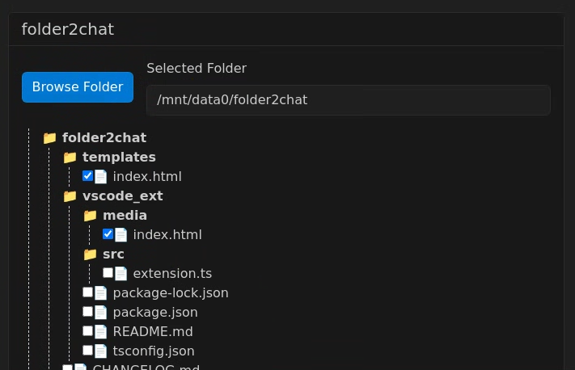
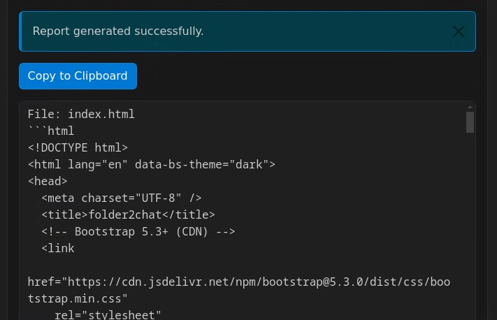

# folder2chat
Quickly copy/paste your code into an LLM. Vibes-based coding in 2025.

Copy the report and paste into your favorite LLM

Both the app and this README file were AI-generated because we're in 2025. I used mostly `o1` to few-shot the app, and `o3-mini-high` to review/patch the final product and produce this README.

## To run the extension

Find `folder2chat` in the extensions marketplace and install. `ctrl+p` and `>folder2chat`

# Functionality
## folder2chat
- Browse Folder: Opens a system dialog (if tkinter is available) to pick a folder.
- Refresh Tree: Displays a hierarchical view (tree) of the chosen folder. By default, each folder is limited to 100 items (folders/files).
- Generate Report: Lets you check checkboxes next to individual files and produce a text-based “report” with their contents. Only files matching the allowed text extensions are included in the report (defaults: .txt, .md, .py, etc.).

## Global Settings
- Items per folder (limit): Adjust how many entries are displayed per folder in the tree.
- Text Extensions: Add or remove the file extensions recognized as “text” (affects which files will be included in the generated report).
- Default Excluded Folders: Control which folders get skipped entirely (e.g., node_modules).
- Save Settings: Saves the new settings to config.json so they persist across restarts.

## Report
- Shows the final compiled text of all selected files (including any error notes if some files could not be read).
- Copy to Clipboard: Copies the report text to your clipboard using the modern Clipboard API (with a legacy fallback).